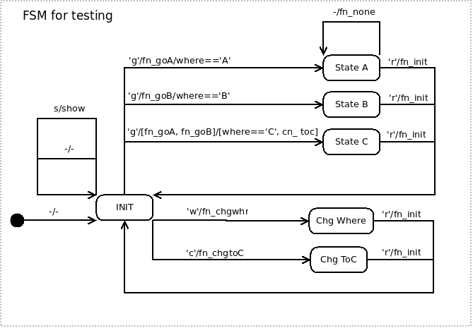

# GWN Cpp Vgb

This is a testing project to enhance the GWN project (GWN, GNU Wireless Network) by coding the core of GWN in C++ (at present it is coded in Python). Please find the GWN Project at https://github.com/vagonbar/gr-gwn/.

## Purpose, difficulties, workarounds

The coding in C++ of the core classes in GWN is expected to improve in performance and become closer to the general design of GNU Radio. Since GWN is implemented as an OOT (Out Of Tree) module in GNU Radio, and GNU Radio does not allow inheritance from user blocks, but only from GNU Radio blocks, the implementation in C++ of the core classes of GWN could not follow the straightforward way of inheriting from a GWN basic block, called gwnblock in GWN. This restriction was not found in Python coded blocks, where inheritance from gwnblock did not show any restrictions. Hence, in a new C++ block, all GWN facilities must be included in the new block. 

To simplify coding of new blocks, a block creation script was written, which includes all necessary code in a new GWN block by modifying a template to include the new block ports, timers and user parameters. The programmer of the new block is expected to rewrite two functions:

`add_init`, which stands for additional initialization, where custom variables can be defined, timers can be set, etc.

`process_data`, where all the actions expected from the new block are coded. This function is invoked when a message is received on a message or timer port, does some processing according to the message received, and optionally outputs another message on any of the available output ports.


## An example block

An example block called `message_timer_example` is already created, and can be tested by running its corresponding QA test, `python/qa_message_timer_example.py`. 

This block receives a message on an input port and outputs the same message on an output port, as well as messages produced by two internal timers, also sent through the output port. In this flowgraph:

    `message_strobe --> message_timer_example --> message_debug`

The `message_debug` block also receives timer messages generated in the block's internal timer.


## Creation of a new block

The creation of a new block similar to the example block described can be done with the following commands:

```
  cd <project_root_directory>/build
  ../libgwn/gwn_modtool.sh message_timer_repeat 1 1 2 
```

The script `gwn_modtool.sh` takes the code from a template GWN block available in the `../libgwn` directory, and modifies the argument list according to the argumets given to `gwn_modtool.sh` as positional parameters: block name, number of input ports, number of output ports, and number of timers.

When running the script, the programmer will be asked to enter a user argument list of his own, such as `std::string message, float period, int count`; this list may be empty. 

`gwn_modtool.sh` is a bash script which uses GNU Radio `gr_modtool` to create the new block, which inherits from GNU Radio general `gr::block`; all the GWN facilities for communicating with other blocks are copied into the new block from the template GWN block. Once created, the programmer will find clearly indicated in the code the functions to rewrite, i.e. `add_init()` and `process_data()`. The new block includes local attributes to capture the user parameters. More specifically, for an argument called `arg_name` in the user parameters list, the script declares an attribute `d_arg_name` of the corresponding type, and inserts an assignment `d_arg_name(arg_name)` in the constructor to capture the argument value (parameter) in the attribute variable.

When creating a new block, an optional FSM (Finite State Machine) can be attached to the block. To this purpose, the script `gwn_modtool.sh` asks whether to create the FSM associated block or not. If the answer is `y`, the FSM block is created. Please see later instructions on how to customize the FSM for specific purposes. 

## A new block creation test

The following commands create a `message_timer_repeat` block, as described in the previous section. To account for the parameteres needed for the example to run as created, rhe user argument list must be:

  `std::string msg_1, float period_1, int count_1, std::string msg_2, float period_2, int count_2`

These parameters indicate the message, period, and quantity (count) of messages emitted by the two internal timers. The complete sequence of commands follows.


```
  cd <project_root_directory>/build
  ../libgwn/gwn_modtool.sh message_timer_example 1 1 2
  (answer questions: argument list, confirm creation, optional FSM block, add C++ QA code)
  make
  make install
  python ../python/qa_message_repeat.py
```

This is for a GNU Radio installation in user space, as described in 
 `https://github.com/gnuradio/pybombs`.
For a system wide GNU Radio installation, instead of `make install` you must write `sudo make install`.

After creation, if you gave other names to parameters, you must alter the timer initialization in the `process_data` function, and also in the QA Python test. Once done, an output similar to the following is expected:

```
===
=== TEST message_timer_example input and output ports 
===

message_timer_example, constructor, name message_timer_example, number_in 1, number_out 1
=== message_timer_example, out ports:
  out port 0: GWNPort name: out_port_0, number: 0, in block: message_timer_example
=== message_timer_example, in ports:
  in port 0: GWNPort name: in_port_0, number: 0, in block: message_timer_example
******* MESSAGE DEBUG PRINT ********
((message . TIMER 1 msg AAAA) (seq_nr . 1) (subtype . timer_0) (type . Timer))
************************************
******* MESSAGE DEBUG PRINT ********
((message . TIMER 2 msg BBBB) (seq_nr . 1) (subtype . timer_1) (type . Timer))
************************************
******* MESSAGE DEBUG PRINT ********
--- A message from message strobe
************************************
******* MESSAGE DEBUG PRINT ********
((message . TIMER 1 msg AAAA) (seq_nr . 2) (subtype . timer_0) (type . Timer))
************************************
******* MESSAGE DEBUG PRINT ********
((message . TIMER 2 msg BBBB) (seq_nr . 2) (subtype . timer_1) (type . Timer))
************************************
******* MESSAGE DEBUG PRINT ********
--- A message from message strobe
************************************
******* MESSAGE DEBUG PRINT ********
((message . TIMER 1 msg AAAA) (seq_nr . 3) (subtype . timer_0) (type . Timer))
************************************
******* MESSAGE DEBUG PRINT ********
((message . TIMER 2 msg BBBB) (seq_nr . 3) (subtype . timer_1) (type . Timer))
************************************
******* MESSAGE DEBUG PRINT ********
--- A message from message strobe
************************************
******* MESSAGE DEBUG PRINT ********
((message . TIMER 1 msg AAAA) (seq_nr . 4) (subtype . timer_0) (type . Timer))
************************************
******* MESSAGE DEBUG PRINT ********
--- A message from message strobe
************************************
******* MESSAGE DEBUG PRINT ********
((message . TIMER 1 msg AAAA) (seq_nr . 5) (subtype . timer_0) (type . Timer))
************************************
******* MESSAGE DEBUG PRINT ********
--- A message from message strobe
************************************
******* MESSAGE DEBUG PRINT ********
((message . TIMER 1 msg AAAA) (seq_nr . 6) (subtype . timer_0) (type . Timer))
************************************
******* MESSAGE DEBUG PRINT ********
--- A message from message strobe
************************************
terminate called after throwing an instance of 'boost::thread_interrupted'
```

In the general case, a different number of input and output ports may be given, and proper customization of the `add_init` and `process_data` functions is expected.

## Optional FSM block

An optional FSM (Finite State Machine) block can be created. The FSM is included in its own block, which can be associated to the new block under creation. The FSM is instanciated as a class accessible from the new block through a pointer in the new block. The FSM is ordered to execute a transition through its function `process(input_symbol, message_to_function, "")`. This FSM function is typically invoked in the `process_data()` function of the new block to which the FSM is associated. The symbol may be any type of data, according to the way the FSM is coded. When receiving the symbol, the FSM machine looks for a transaction which includes the received symbol, the current state, and a condition which must evaluate to true. If such a transaction is found, an action function is executed, and a new state is made the current state of the FSM. The action function may produce a result which is returned to the caller, i.e. the `process_data()` function in the new block.

To customize the FSM block, the following sections must be rewritten:

In the `include/gwncppvgb/<fsm_block>.h` file:

`// user defined variables and functions` 

In the `lib/<fsm_block>.cc` file :

`// user defined variables and functions`

`// condition function definitions`

`// other user defined functions`

`// user transitions`

In the new block to which the FSM is associated, these sections must be rewritten:

`added_init()` function, for additional initialization, in particular the lines
 
    `  // GWN TAG include optional FSM`
    `  //d_fsm = new gwnfsm_dev("INIT");`

`/* Timer and input messages processing, REWRITE as desired. */`

`// invoke FSM with symbol`

`/* Additional initialization, REWRITE as desired. */`


Please see the following example files for a block with an associated FSM block:
* example block: files `include/gwncppvgb/fsm_test.h, lib/fsm_test_impl.h, lib/fsm_test_impl.cc`. This is the example block to which the FSM block is associated.
* FSM associated block: `include/gwncppvgb/fsmblk.h, lib/fsmblk.cc`. This is the associated block which implements the FSM machine. Transitions, action functions, function conditions and custom variables which account for a specific FSM are included in these files.
* QA test code: file `python/qa_fsm_test_example.py`.
* GRC flowgraph: file `examples/fsm_test_example.grc.`

The example FSM symbols are characters. The example block `symbol_strobe` receives a string as a parameter and emits one character at a time. The example flowgraph `grc/symbol_strobe_test.grc` shows how it works.

The test FSM blocks implement the following FSM:



A descriptions of the GWN FSM as autonomous code can be found in the [gwnfsm](https://github.com/vagonbar/gwnfsm) project.

