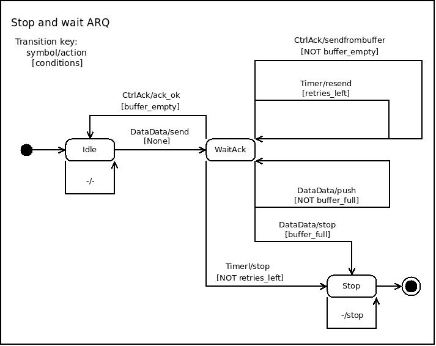

# GWN : A Stop and Wait procotol example

This is a very simple example of a telecommunication protocol in which the sender waits acknowledge of each message before sending the next message.

## The flowgraph

The flowgraph in GRC (GNU Radio Companion) can be seen in the following image:


## The FSM
 
The FSM implementing this protocol is shown in this graph:



## The Stop and Wait send block

Messages are GWN messages, a PMT dictionary with keys Type, Subtype, a sequence number, and possibly other fields at the programmer's choice, not used in this example.

The `process_data` function in the `Stop and wait send` block receives messages from:
* the `Data Source` block, a message to be transmitted.
* the `Stop and Wait ACK` block, which emits an ACK message for each message received.
* the internal timer which sends a message after some time elapsed; this is the time wated for an ACK before resending the message.

The `process_data` function receives a message and an identifier for the port on which the message was received. The message is passed to the FSM, which returns a command and a message. The command indicates an action for the block to perform. The message is a message to be sent, if the received command indicates such actions.

All handling of ports and timers is done in the main block, which has access to both entities, ports and timers.

## The Stop and Wait FSM block

The FSM receives a message from the main block, unpacks it and determines its Type, which acts as an input symbol for the FSM. The FSM searches for a transition corresponding to the input symbol and present state of the FSM. If one is found, and the conditions for this transition are met, an action function is executed. The action function produces a command, and inserts in a local atribute the message to send. The FSM returns the command and message to the main block.

The following output shows transmit and receive of 5 messages with a probability loss of 0.5 in the virtual channel block, 3 retries and a max buffer size of 5. Please note retries and buffer size, which account for losses, but finally all 5 messages are received.
```
FSM buf:0 retries:0 type:Data nr:1 FSM cmd:Transmit
FSM buf:0 retries:1 type:Timer nr:1 FSM cmd:Transmit
***** GWN Data Message sink *****
(FSM buf:(0 retries:seq_nr1 type:Control nr: . 1 FSM cmd:AckReceived
1) (payload . Data payload) (subtype . Data) (type . Data))
*********************************
FSM buf:0 retries:0 type:Data nr:2 FSM cmd:Transmit
FSM buf:0 retries:1 type:Timer nr:1 FSM cmd:Transmit
FSM buf:1 retries:1 type:Data nr:3 FSM cmd:Transmit
FSM buf:1 retries:2 type:Timer nr:1 FSM cmd:Transmit
FSM buf:1 retries:3 type:Timer nr:1 FSM cmd:Transmit
***** GWN Data Message sink *****
((seq_nr . 2) (payload . Data payload) (subtype . Data) (type . Data))
*********************************
FSM buf:0 retries:0 type:Control nr:2 FSM cmd:Transmit
FSM buf:1 retries:0 type:Data nr:4 FSM cmd:Transmit
***** GWN Data Message sink *****
((seq_nr . 3) (payload . Data payload) (subtype . Data) (type . Data))
*********************************
FSM buf:0 retries:0 type:Control nr:3 FSM cmd:Transmit
FSM buf:0 retries:1 type:Timer nr:1 FSM cmd:Transmit
FSM buf:0 retries:1 type:Control nr:4 FSM cmd:AckReceived
***** GWN Data Message sink *****
((seq_nr . 4) (payload . Data payload) (subtype . Data) (type . Data))
*********************************
FSM buf:0 retries:0 type:Data nr:5 FSM cmd:Transmit
FSM buf:0 retries:1 type:Timer nr:1 FSM cmd:Transmit
***** GWN Data Message sink *****
((seq_nr . 5) (payload . Data payload) (subtype . Data) (type . Data))
*********************************
```
A test showing exhaustion of retries, with probability loss of 0.8, 2 retries and buffer length of 5:
```
FSM buf:0 retries:0 type:Data nr:1 FSM cmd:Transmit
FSM buf:0 retries:1 type:Timer nr:1 FSM cmd:Transmit
FSM buf:0 retries:2 type:Timer nr:1 FSM cmd:Transmit
FSM buf:1 retries:2 type:Data nr:2 FSM cmd:Transmit
FSM buf:1 retries:3 type:Timer nr:1 FSM cmd:Transmit
***** GWN Data Message sink *****
((seq_nr . FSM buf:10 retries:0 type:Control nr:)1 FSM cmd: Transmit(
payload . Data payload) (subtype . Data) (type . Data))
*********************************
FSM buf:1 retries:0 type:Data nr:3 FSM cmd:Transmit
FSM buf:1 retries:1 type:Timer nr:1 FSM cmd:Transmit
FSM buf:1 retries:2 type:Timer nr:1 FSM cmd:Transmit
FSM buf:2 retries:2 type:Data nr:4 FSM cmd:Transmit
***** GWN Data Message sink *****
((seq_nr . 2) (payload . Data payload) (subtype . Data) (type . Data))
*********************************
FSM buf:1 retries:0 type:Control nr:2 FSM cmd:Transmit
FSM buf:1 retries:1 type:Timer nr:1 FSM cmd:Transmit
FSM buf:1 retries:2 type:Timer nr:1 FSM cmd:Transmit
FSM buf:2 retries:2 type:Data nr:5 FSM cmd:Transmit
FSM buf:2 retries:3 type:Timer nr:1 FSM cmd:Transmit
FSM buf:3 retries:3 type:Data nr:6 FSM cmd:Transmit
FSM buf:3 retries:3 type:Timer nr:1 FSM cmd:StopNoRetriesLeft
FSM STOPPED: StopNoRetriesLeft
  buffer size: 3, retries: 3
```
A test showing exhaustion of buffer capacity, with probability loss of 0.8, 5 retries and buffer length of 2:
```
FSM buf:0 retries:0 type:Data nr:1 FSM cmd:Transmit
FSM buf:0 retries:1 type:Timer nr:1 FSM cmd:Transmit
FSM buf:0 retries:2 type:Timer nr:1 FSM cmd:Transmit
FSM buf:1 retries:2 type:Data nr:2 FSM cmd:Transmit
FSM buf:1 retries:3 type:Timer nr:1 FSM cmd:Transmit
***** GWN Data Message sink *****
((seq_nr . 1) FSM buf:0 retries:0 type:Control nr:1 FSM cmd:Transmit(
payload . Data payload) (subtype . Data) (type . Data))
*********************************
FSM buf:1 retries:0 type:Data nr:3 FSM cmd:Transmit
FSM buf:1 retries:1 type:Timer nr:1 FSM cmd:Transmit
FSM buf:1 retries:2 type:Timer nr:1 FSM cmd:Transmit
FSM buf:2 retries:2 type:Data nr:4 FSM cmd:Transmit
FSM buf:2 retries:3 type:Timer nr:1 FSM cmd:Transmit
FSM buf:2 retries:4 type:Timer nr:1 FSM cmd:Transmit
***** GWN Data Message sink *****
((seq_nr . 2FSM) buf: (1payload retries: . 0 type:Data payloadControl) nr: 2 FSM cmd:Transmit
(subtype . Data) (type . Data))
*********************************
FSM buf:2 retries:0 type:Data nr:5 FSM cmd:Transmit
FSM buf:2 retries:1 type:Timer nr:1 FSM cmd:Transmit
FSM buf:3 retries:1 type:Data nr:6 FSM cmd:Transmit
FSM buf:3 retries:2 type:Timer nr:1 FSM cmd:Transmit
FSM buf:3 retries:3 type:Timer nr:1 FSM cmd:Transmit
FSM buf:3 retries:3 type:Data nr:7 FSM cmd:StopBufferFull
FSM STOPPED: StopBufferFull
  buffer size: 3, retries: 3
```

[Back to README](../../README.md)

